<div align="center">

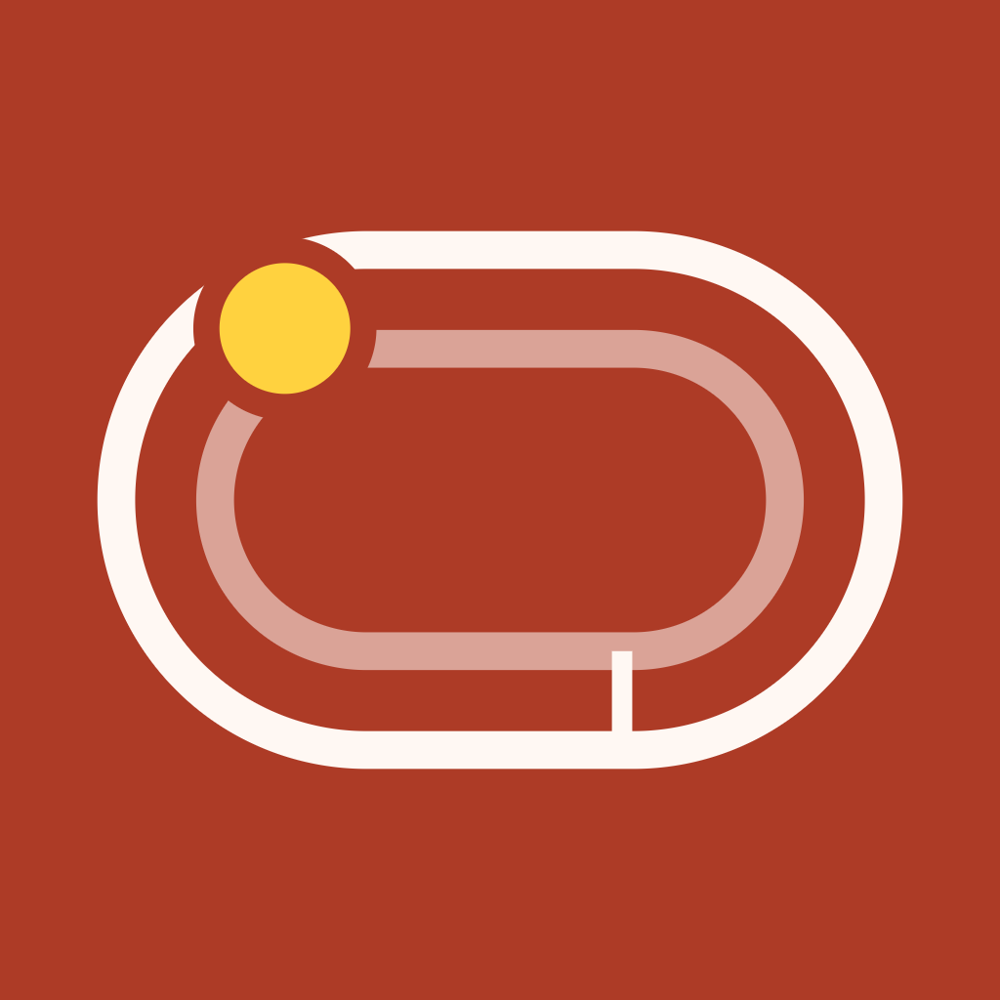

# Daur

**A 12-week diet and fitness app for Dhaka.**
Four meals a day, push / pull / legs at the gym, and a running track that fills up as you go.

*Daur* (দৌড়) is Bangla for *run*.


</div>

---

## What it does

Daur turns a 12-week plan (to lose, keep or gain weight) into **84 days of a simple daily loop**: log four meals, drink your water, walk your steps, train on your split. Every logged meal moves a runner one leg around a 400 m track. Four meals close the day. Closed days build a streak, and the weekly average weight is what counts, not the noise of one morning.

It's also built for the people around you: **a trainer** who writes your diet chart and workout and follows your progress, and **a family member** (often the one who cooks) who sees what to cook today, in Bangla.

It's built around how people in Bangladesh actually eat and type: bhat, dal, murgi, ilish and dudh cha are first-class foods, and search understands *bhat*, *vat*, *rice* and *ভাত* as the same thing.

## The app, start to finish

In the order you meet it. Screenshots use sample data: day 38 of the plan.

### 1 · First run

Make an account, say how you'll use Daur, then set up your plan: day 1, starting weight, and your goal (lose, keep or gain), which sets every target.

<table>
<tr>
<td align="center">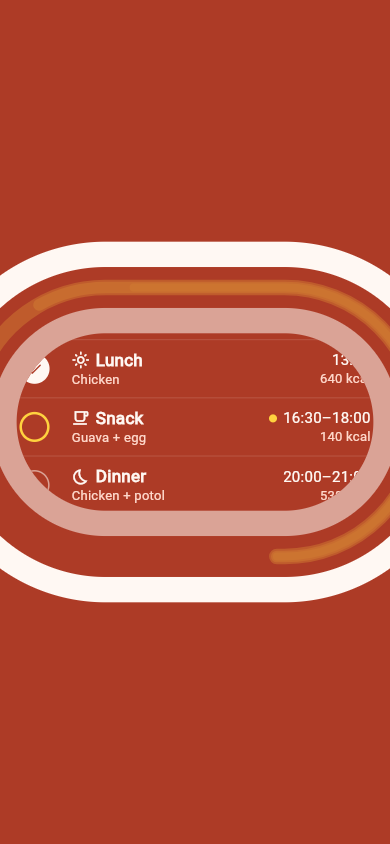<br><sub><b>Splash</b><br>the runner sprints, then the track opens</sub></td>
<td align="center">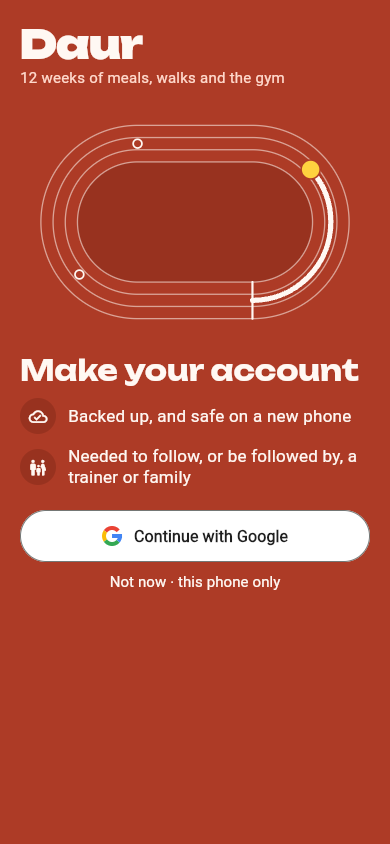<br><sub><b>Make your account</b><br>Google, or this phone only</sub></td>
<td align="center">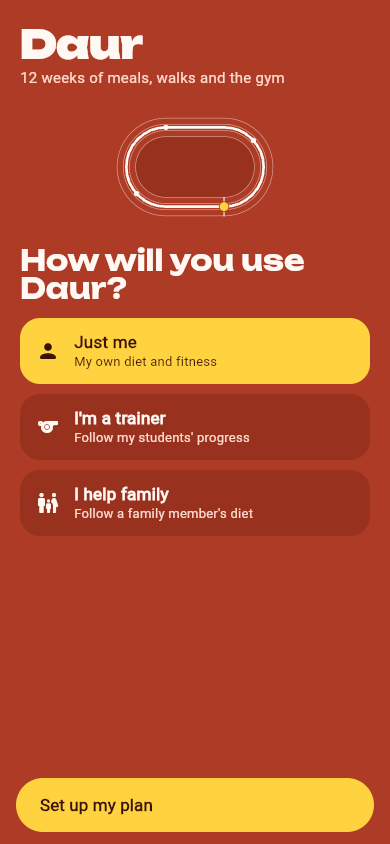<br><sub><b>How will you use Daur?</b><br>just me · trainer · family</sub></td>
</tr>
<tr>
<td align="center">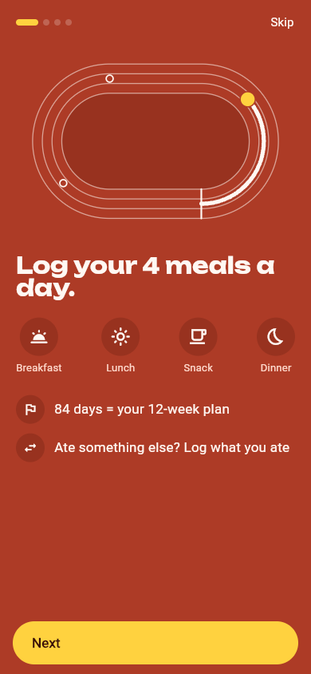<br><sub><b>The idea</b><br>4 meals a day, 84 days</sub></td>
<td align="center">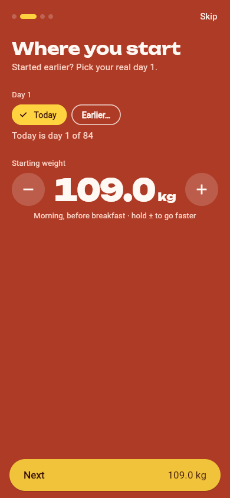<br><sub><b>Where you start</b><br>day 1 and starting weight</sub></td>
<td align="center">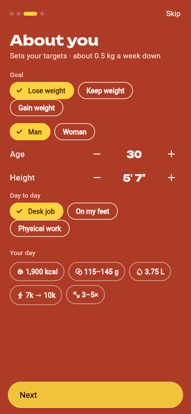<br><sub><b>About you</b><br>lose · keep · gain, targets worked out live</sub></td>
</tr>
<tr>
<td align="center">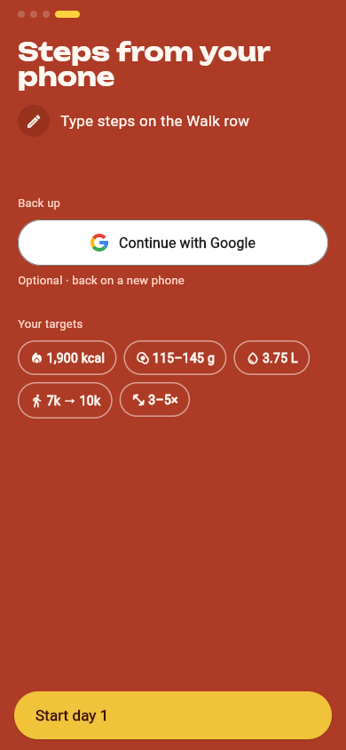<br><sub><b>Steps and backup</b><br>Health Connect / Apple Health</sub></td>
<td></td>
<td></td>
</tr>
</table>

### 2 · Every day

Log four meals, and Daur keeps the rest in view: what's left to eat or burn, water, steps, sleep.

<table>
<tr>
<td align="center">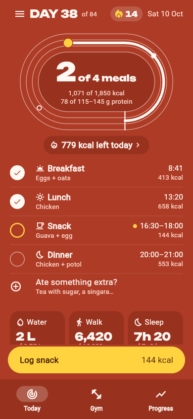<br><sub><b>Today</b><br>the track, meals, water · walk · sleep</sub></td>
<td align="center">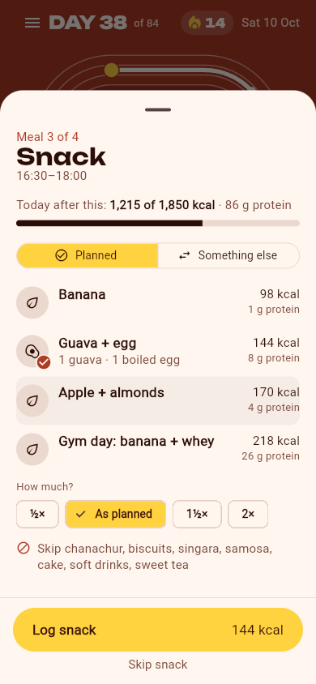<br><sub><b>Log a meal</b><br>planned option and portion</sub></td>
<td align="center">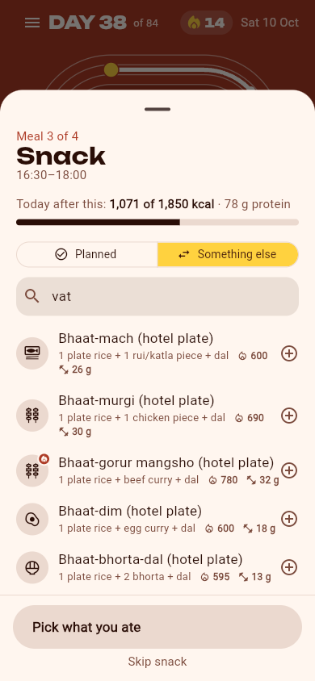<br><sub><b>Something else</b><br>"vat" finds every bhaat plate</sub></td>
</tr>
<tr>
<td align="center">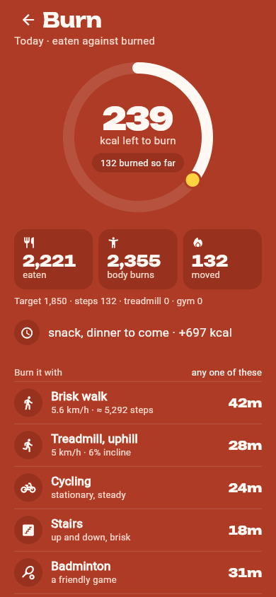<br><sub><b>Burn</b><br>over target: minutes to burn it off</sub></td>
<td align="center">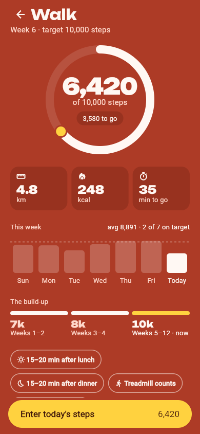<br><sub><b>Walk</b><br>ring, week, the build-up to 10k</sub></td>
<td align="center">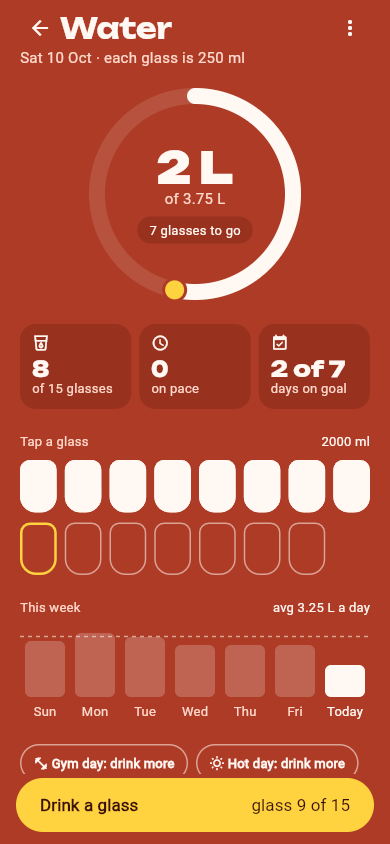<br><sub><b>Water</b><br>glasses, pace, days on goal</sub></td>
</tr>
<tr>
<td align="center">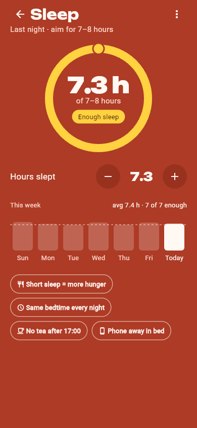<br><sub><b>Sleep</b><br>last night and the week</sub></td>
<td align="center">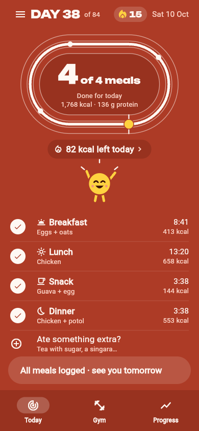<br><sub><b>Day done</b><br>4 of 4: Dau cheers</sub></td>
<td></td>
</tr>
</table>

### 3 · Training and progress

<table>
<tr>
<td align="center">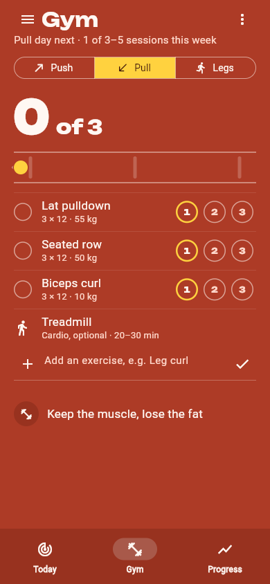<br><sub><b>Gym</b><br>push / pull / legs, one tap per set</sub></td>
<td align="center">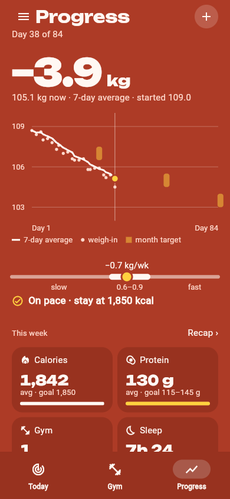<br><sub><b>Progress</b><br>weight trend and pace for your goal</sub></td>
<td align="center">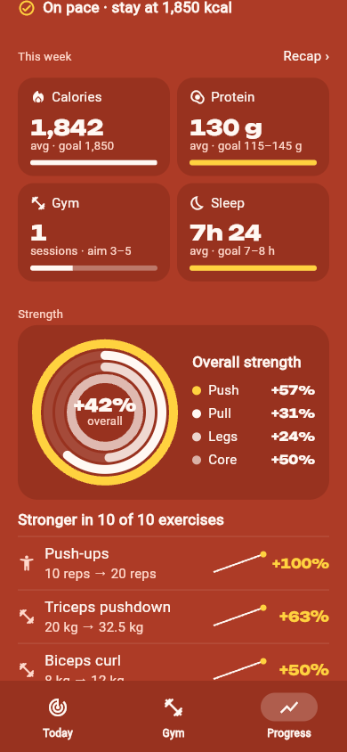<br><sub><b>Strength</b><br>rings per body area, every lift</sub></td>
</tr>
<tr>
<td align="center">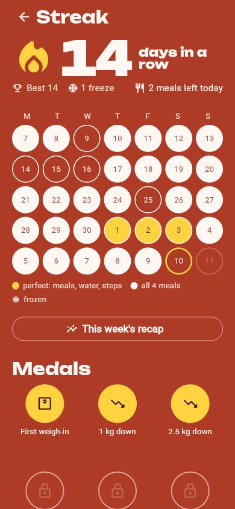<br><sub><b>Streak</b><br>calendar, freezes, medals</sub></td>
<td align="center">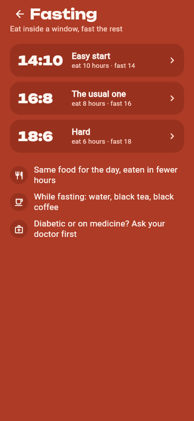<br><sub><b>Fasting</b><br>pick a plan</sub></td>
<td align="center">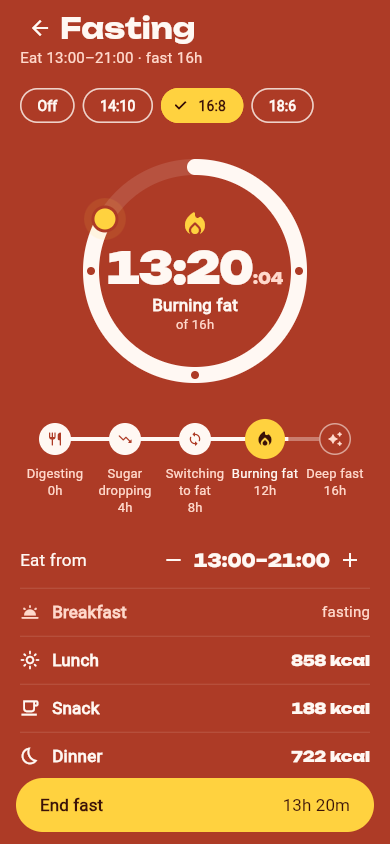<br><sub><b>A fast, live</b><br>a ring through the stages</sub></td>
</tr>
<tr>
<td align="center">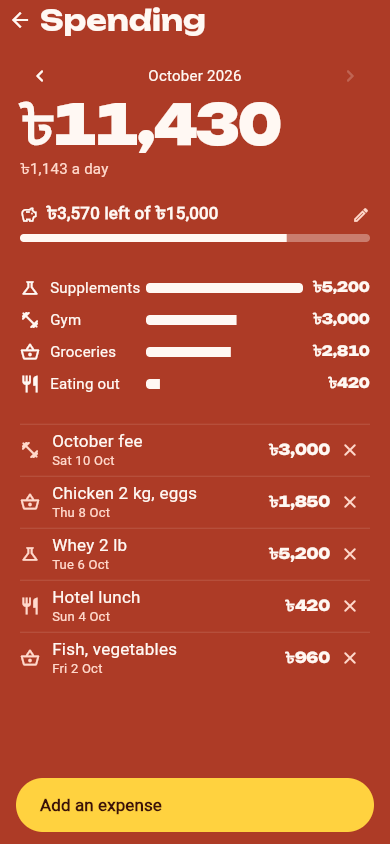<br><sub><b>Spending</b><br>what the diet and gym cost, in ৳</sub></td>
<td></td>
<td></td>
</tr>
</table>

### 4 · Outside the app

<table>
<tr>
<td align="center">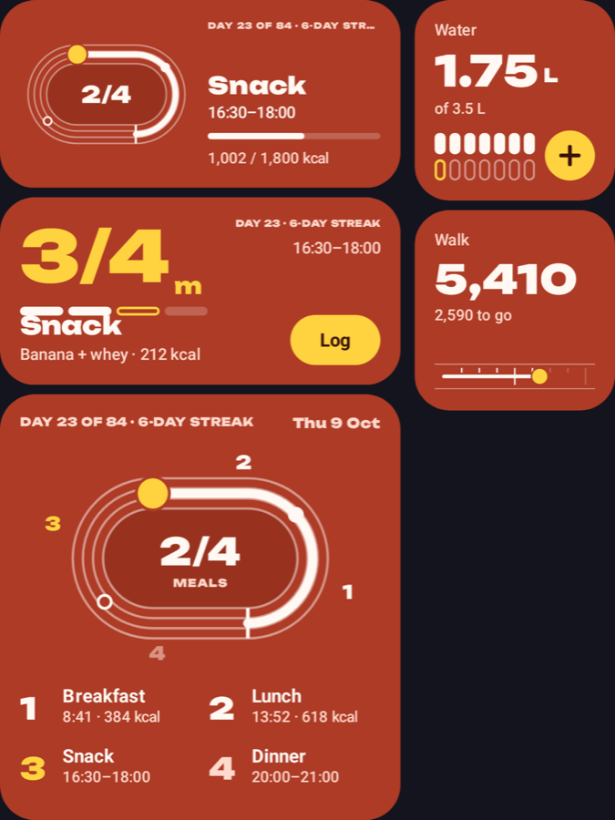<br><sub><b>Widgets</b><br>the same design on Android and iPhone</sub></td>
<td align="center">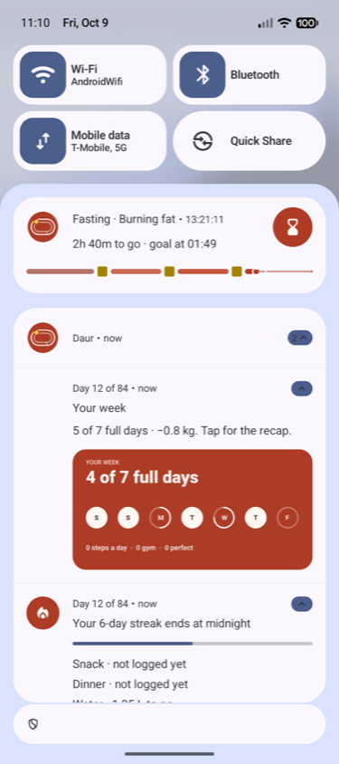<br><sub><b>Notifications</b><br>the fast live, the Sunday recap, what's still open</sub></td>
<td></td>
</tr>
</table>

### 5 · The people who help

Invite a trainer and a family member with a code each. The trainer follows every student from one dashboard and writes the diet chart and the workout; the family member who cooks sees what to cook today, in Bangla.

<table>
<tr>
<td align="center">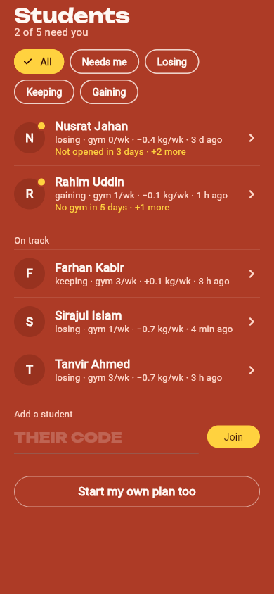<br><sub><b>Students</b><br>a trainer's dashboard: who needs you, and why</sub></td>
<td align="center">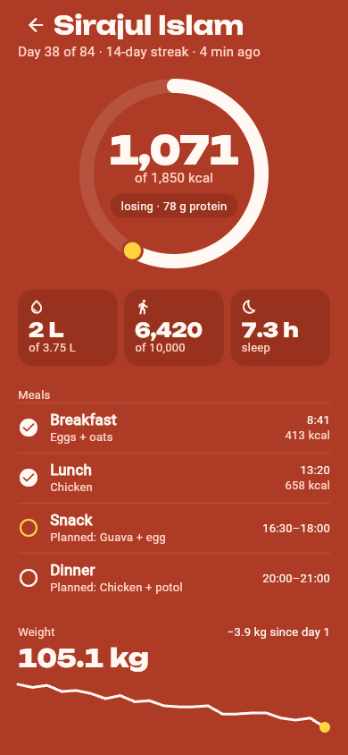<br><sub><b>A student</b><br>their day, week, gym, strength, feedback</sub></td>
<td align="center">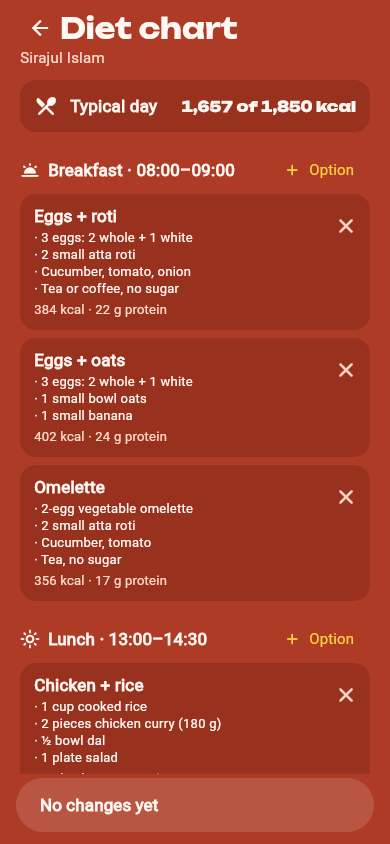<br><sub><b>Diet chart</b><br>the trainer writes it, with amounts</sub></td>
</tr>
<tr>
<td align="center">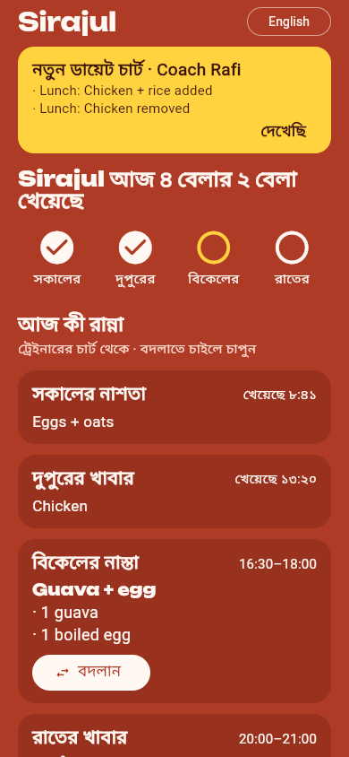<br><sub><b>Ma's page</b><br>what to cook today, in Bangla</sub></td>
<td></td>
<td></td>
</tr>
</table>

## Features

| Area | What you get |
|---|---|
| **Goal** | Lose, keep or gain weight: sets the daily target (−500 / maintenance / +300 kcal), protein, month targets, the pace gauge, medals and Burn |
| **Meals** | 4 meals with planned options sized to your calorie target · portions ½× to 2× · "something else" from a 201-food Dhaka list or your own foods · extras between meals · skip honestly · undo everything |
| **AI estimates** | Type *"2 parathas, dim bhaji and milk tea"* and get each item with kcal, protein and category, grounded in the Dhaka food list · saved estimates reused with no AI · free-tier counter shows uses left today |
| **Search** | English, every Banglish spelling and Bangla script (448 researched word groups) · typos forgiven · "fish" finds rui and ilish, but "rui" doesn't find ilish |
| **Gym** | Push / pull / legs rotation · tap a set circle to log it · rest timer on the lock screen · automatic step-ups when every rep is hit, a 10% deload after two short sessions · stop early when strength runs out |
| **Burn** | Eaten against what your body and exercise burned · what's left to burn to stay on plan, as minutes of walking, treadmill, cycling, stairs, badminton or swimming at your weight · gaining instead gets **Fuel**: kcal still to eat, with easy foods · shown on Today, the 21:15 reminder and the widget |
| **Walk · Water · Sleep** | Each a page with a ring to the day's goal, tiles, the week, and (Walk) steps hour by hour from Health Connect |
| **Progress** | Weight chart with the 7-day average and month targets · pace gauge for your goal · stall detection · this week's calories, protein, gym, sleep · overall strength rings · every lift start → now |
| **Habits** | Streak with freezes · "streak ends at midnight" reminder · perfect days (meals + water + steps) · medals · Sunday recap · family board |
| **Body** | Personal targets from sex, age, height (feet and inches) and activity · water goal · steps 7k → 10k · sleep from Health Connect |
| **Fasting** | 14:10, 16:8, 18:6 with a movable window · meals outside it become "Fasting" and the rest grow so the day stays the same size · start / end real fasts with a live ring through the stages (digesting → burning fat → deep fast) · a Live Update on Android 16 and a Live Activity on iPhone · window reminders |
| **Ramadan** | Sehri and iftar times worked out from the sun for any of Bangladesh's 64 districts or 18 cities abroad (Dhaka matches the Islamic Foundation's table; the first place is guessed from the phone's time zone) · the day's meals become Sehri, Iftar, a snack after Maghrib and dinner after Tarawih · the fast counts itself at iftar · "Not fasting today" keeps a list of fasts to make up · sehri and iftar reminders, water reminders only after iftar |
| **Couple** | Menu → Couple: one shares a code, the other enters it, and it links both ways · a streak you keep together and the week with a heart on days you both closed · a Saturday-to-Friday race (up to 300 points a day for meals, water and steps) with a fun stake for the loser · a team step goal · today as two runners on one track, head to head · one-tap nudges · switches to keep your weight or your food from your partner (they get their own copy of your day without it) · Unlink stops both |
| **Friends** | Menu → Friends: a group of up to 20 with a code · this week's leaderboards (Saturday to Friday): **Overall** race points (up to 300 a day for meals, water and steps, each against your own targets), **Steps**, **Lifted** (kg × reps), **Consistency** (full days), **Water** and **Extra kcal** (eaten over your own target; the couple's page and the family board show it too) · the top three on a podium, everyone else with a bar against the leader, their streak and today's meals |
| **Coaching** | Invite a **trainer** and a **family helper** with a code each · they see a live summary of your day, weight and (trainer) gym and strength, never your spending · notes both ways · the trainer writes your **diet chart** and your **workout** (push / pull / legs, sets, reps, kg), and each reaches your phone with Undo · a helper can swap today's meals within the trainer's options |
| **Trainer** | A **Students** dashboard: who needs you first and why (not opened in days, no gym, weight not moving for their goal, over or short today), filters by goal, one-tap feedback, a Sunday "3 of 8 need you" |
| **Ma's page** | For the family member who cooks: did he eat (one sentence, four big circles), **what to cook today** with amounts, the whole chart to share or print, water and weight in plain words, one-tap replies · Bangla first, English one tap away |
| **Money** | Spending by category against a monthly budget |
| **Glanceable** | Five widgets drawn to the same design on Android and iPhone · Live Activities for rest, treadmill and the running fast · reminders with their own icons, the plan day, progress bars, an evening list of what's still open and a Sunday recap picture |
| **Native feel** | One look, two sets of controls: iPhone gets a glass tab bar, a More page, action sheets, iOS alerts and pickers; Android keeps Material |
| **Dau** | The runner dot as a mascot: cheers a closed day, waits on empty screens, looks tired on Ma's page when meals are missing · decoration only |
| **Data** | Works offline · Google sign-in backs up to Firestore · export as JSON · delete cloud data and account · erase the phone |

## Who uses Daur

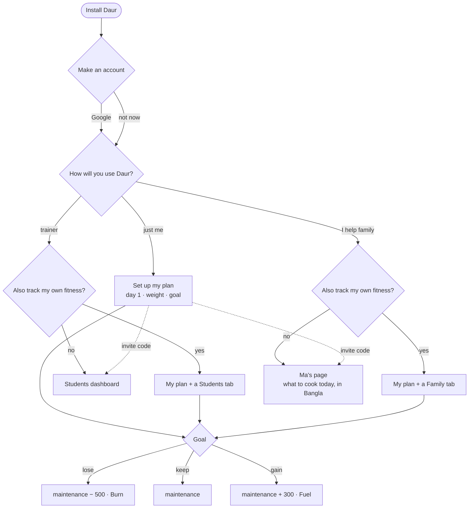
```mermaid
flowchart TD
    install([Install Daur]) --> account{Make an account}
    account -->|Google| role{How will you use Daur?}
    account -->|not now| role
    role -->|just me| plan[Set up my plan<br/>day 1 · weight · goal]
    role -->|trainer| tOwn{Also track my own fitness?}
    role -->|I help family| fOwn{Also track my own fitness?}
    tOwn -->|yes| planT[My plan + a Students tab]
    tOwn -->|no| students[Students dashboard]
    fOwn -->|yes| planF[My plan + a Family tab]
    fOwn -->|no| ma[Ma's page<br/>what to cook today, in Bangla]
    plan --> goal{Goal}
    planT --> goal
    planF --> goal
    goal -->|lose| lose[maintenance − 500 · Burn]
    goal -->|keep| keep[maintenance]
    goal -->|gain| gain[maintenance + 300 · Fuel]
    plan -. invite code .-> students
    plan -. invite code .-> ma
```

## How a day works

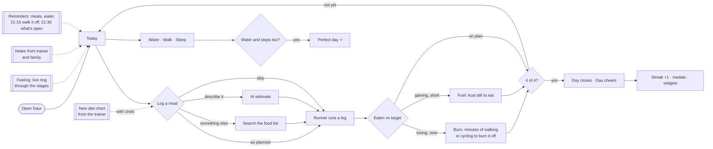
```mermaid
flowchart LR
    open([Open Daur]) --> today[Today]
    today --> meal{Log a meal}
    meal -->|as planned| leg[Runner runs a leg]
    meal -->|something else| search[Search the food list]
    meal -->|describe it| ai[AI estimate]
    meal -->|skip| leg
    search --> leg
    ai --> leg
    leg --> balance{Eaten vs target}
    balance -->|losing, over| burn[Burn: minutes of walking<br/>or cycling to burn it off]
    balance -->|gaining, short| fuel[Fuel: kcal still to eat]
    balance -->|on plan| four
    burn --> four
    fuel --> four
    four{4 of 4?} -->|not yet| today
    four -->|yes| close[Day closes · Dau cheers]
    close --> streak[Streak +1 · medals · widgets]
    today --> tiles[Water · Walk · Sleep]
    tiles --> perfect{Water and steps too?}
    perfect -->|yes| star[Perfect day ⭐]
    fast[[Fasting: live ring<br/>through the stages]] -.-> today
    chart[[New diet chart<br/>from the trainer]] -.->|with Undo| meal
    notes[[Notes from trainer<br/>and family]] -.-> today
    reminders[[Reminders: meals, water,<br/>21:15 walk it off, 21:30 what's open]] -.-> today
```

## Architecture

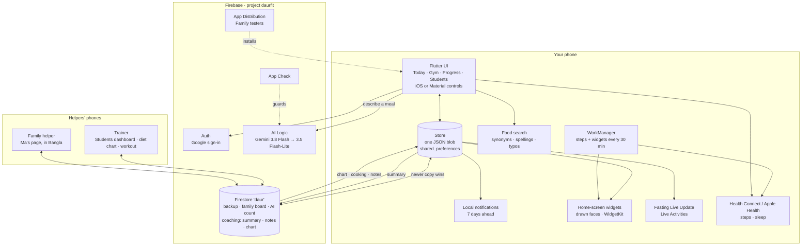
```mermaid
flowchart TB
    subgraph phone[Your phone]
        ui[Flutter UI<br/>Today · Gym · Progress · Students<br/>iOS or Material controls]
        store[(Store<br/>one JSON blob<br/>shared_preferences)]
        search[Food search<br/>synonyms · spellings · typos]
        notif[Local notifications<br/>7 days ahead]
        widgets[Home-screen widgets<br/>drawn faces · WidgetKit]
        live[Fasting Live Update<br/>Live Activities]
        work[WorkManager<br/>steps + widgets every 30 min]
        health[Health Connect / Apple Health<br/>steps · sleep]
    end
    subgraph helpers[Helpers' phones]
        trainer[Trainer<br/>Students dashboard · diet chart · workout]
        ma[Family helper<br/>Ma's page, in Bangla]
    end
    subgraph firebase[Firebase · project daurfit]
        auth[Auth<br/>Google sign-in]
        fs[(Firestore 'daur'<br/>backup · family board · AI count<br/>coaching: summary · notes · chart)]
        ai[AI Logic<br/>Gemini 3.8 Flash → 3.5 Flash-Lite]
        check[App Check]
        dist[App Distribution<br/>Family testers]
    end
    ui <--> store
    ui --> search
    store --> notif
    store --> widgets
    store --> live
    work --> health
    work --> widgets
    ui --> health
    store <-->|newer copy wins| fs
    store -->|summary| fs
    fs -->|chart · cooking · notes| store
    trainer <--> fs
    ma <--> fs
    ui --> auth
    ui -->|describe a meal| ai
    check -.guards.-> ai
    dist -.installs.-> ui
```

### An AI estimate, step by step

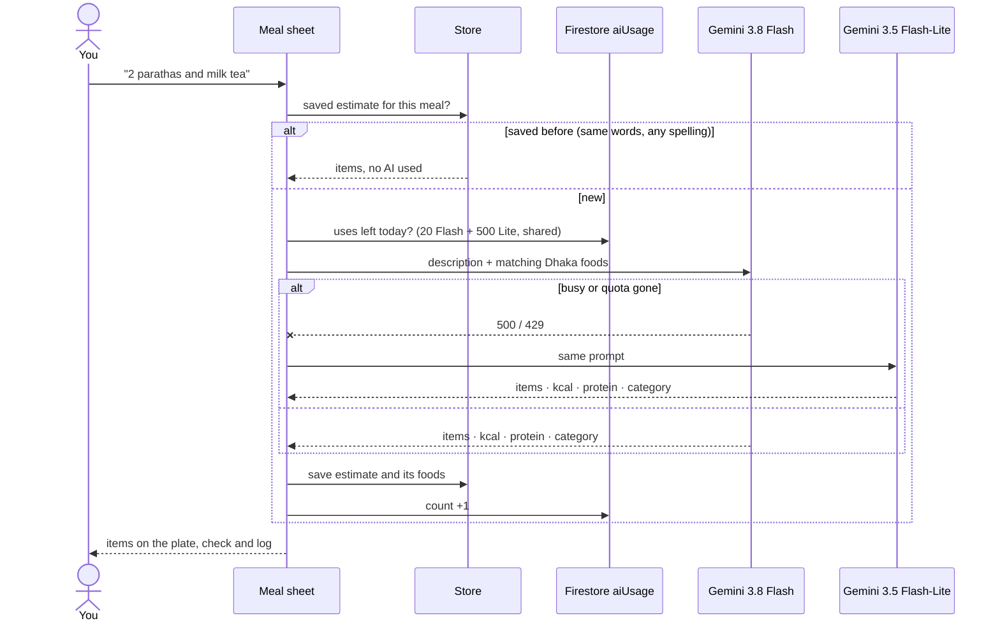
```mermaid
sequenceDiagram
    actor You
    participant Sheet as Meal sheet
    participant Store
    participant Cloud as Firestore aiUsage
    participant Flash as Gemini 3.8 Flash
    participant Lite as Gemini 3.5 Flash-Lite
    You->>Sheet: "2 parathas and milk tea"
    Sheet->>Store: saved estimate for this meal?
    alt saved before (same words, any spelling)
        Store-->>Sheet: items, no AI used
    else new
        Sheet->>Cloud: uses left today? (20 Flash + 500 Lite, shared)
        Sheet->>Flash: description + matching Dhaka foods
        alt busy or quota gone
            Flash--xSheet: 500 / 429
            Sheet->>Lite: same prompt
            Lite-->>Sheet: items · kcal · protein · category
        else
            Flash-->>Sheet: items · kcal · protein · category
        end
        Sheet->>Store: save estimate and its foods
        Sheet->>Cloud: count +1
    end
    Sheet-->>You: items on the plate, check and log
```

### Gym progression

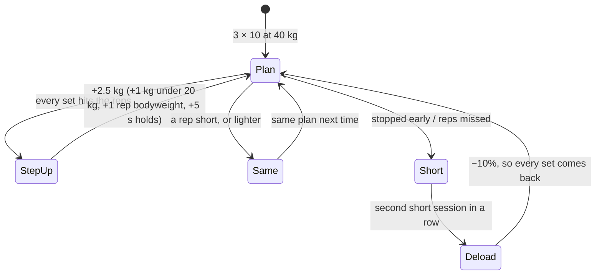
```mermaid
stateDiagram-v2
    [*] --> Plan: 3 × 10 at 40 kg
    Plan --> StepUp: every set hits the reps
    StepUp --> Plan: +2.5 kg (+1 kg under 20 kg, +1 rep bodyweight, +5 s holds)
    Plan --> Same: a rep short, or lighter
    Same --> Plan: same plan next time
    Plan --> Short: stopped early / reps missed
    Short --> Deload: second short session in a row
    Deload --> Plan: −10%, so every set comes back
```

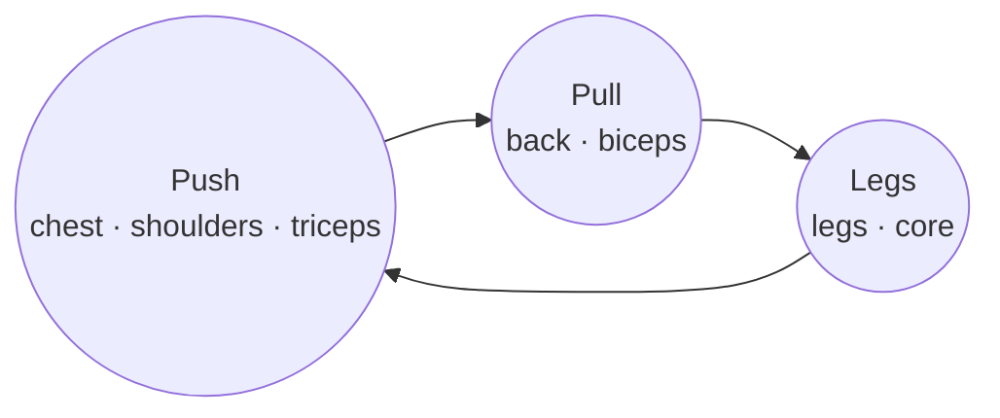
```mermaid
flowchart LR
    push((Push<br/>chest · shoulders · triceps)) --> pull((Pull<br/>back · biceps)) --> legs((Legs<br/>legs · core)) --> push
```

The next day is the one after the last day you actually trained, so a missed gym day never shifts the rotation.

### Coaching: a trainer and a family helper

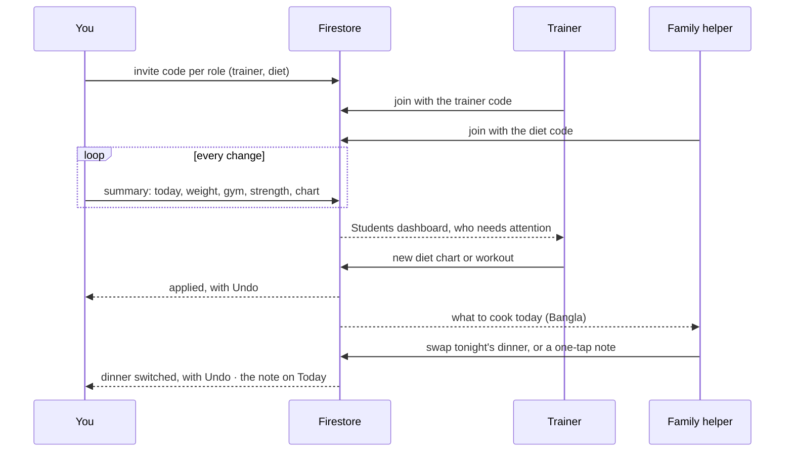
```mermaid
sequenceDiagram
    participant You
    participant FS as Firestore
    participant Trainer
    participant Ma as Family helper
    You->>FS: invite code per role (trainer, diet)
    Trainer->>FS: join with the trainer code
    Ma->>FS: join with the diet code
    loop every change
        You->>FS: summary: today, weight, gym, strength, chart
    end
    FS-->>Trainer: Students dashboard, who needs attention
    Trainer->>FS: new diet chart or workout
    FS-->>You: applied, with Undo
    FS-->>Ma: what to cook today (Bangla)
    Ma->>FS: swap tonight's dinner, or a one-tap note
    FS-->>You: dinner switched, with Undo · the note on Today
```

### Cloud data

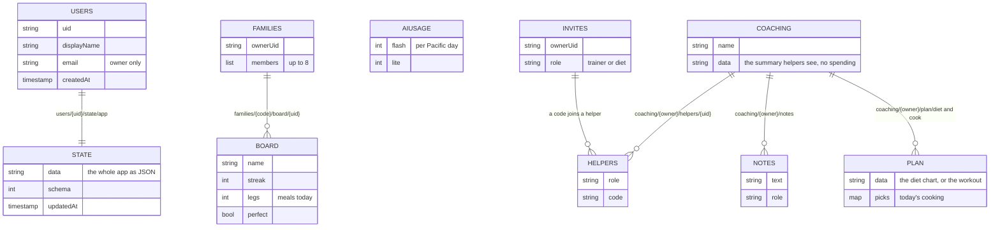
```mermaid
erDiagram
    USERS ||--|| STATE : "users/{uid}/state/app"
    USERS {
        string uid
        string displayName
        string email "owner only"
        timestamp createdAt
    }
    STATE {
        string data "the whole app as JSON"
        int schema
        timestamp updatedAt
    }
    FAMILIES ||--o{ BOARD : "families/{code}/board/{uid}"
    FAMILIES {
        string ownerUid
        list members "up to 8"
    }
    BOARD {
        string name
        int streak
        int legs "meals today"
        bool perfect
    }
    AIUSAGE {
        int flash "per Pacific day"
        int lite
    }
    INVITES ||--o{ HELPERS : "a code joins a helper"
    INVITES {
        string ownerUid
        string role "trainer or diet"
    }
    COACHING ||--o{ HELPERS : "coaching/{owner}/helpers/{uid}"
    COACHING ||--o{ NOTES : "coaching/{owner}/notes"
    COACHING ||--o{ PLAN : "coaching/{owner}/plan/diet and cook"
    COACHING {
        string name
        string data "the summary helpers see, no spending"
    }
    HELPERS {
        string role
        string code
    }
    NOTES {
        string text
        string role
    }
    PLAN {
        string data "the diet chart, or the workout"
        map picks "today's cooking"
    }
```

Security rules (`firestore.rules`) keep each person's data private to them, the family board visible only to its members, and every write validated field by field. For coaching, only helpers you invited can read your summary; only you and your trainer can write the diet chart and the workout; a family helper can only pick among the trainer's options for today. A couple links both ways: each joins with the other's partner code, reads only the partner copy of the other's day (never the full summary or the plan) and can't pose as a trainer. `test/firestore_rules.test.mjs` checks all of it (98 cases) against the Firestore emulator.

## Getting started

```bash
flutter pub get
flutter run -d <android-device>        # or: -d chrome, or an iPhone
flutter test                           # 50 tests: store, search, progression, reminders, goals, coaching, couple, friends
```

The AI estimate needs an App Check token. Put it in `dart_defines.json` (git-ignored):

```json
{ "APPCHECK_DEBUG_TOKEN": "your-registered-debug-token" }
```

and build with `--dart-define-from-file=dart_defines.json`. Without it everything else still works.

**Health data:** Android reads steps and sleep through Health Connect (built into Android 14+). On iOS, add the HealthKit capability in Xcode. On the web, steps and sleep are typed in.

## Release to testers

Every merge to `main` ships itself:

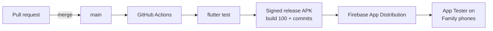
```mermaid
flowchart LR
    pr[Pull request] -->|merge| main[main]
    main --> ci[GitHub Actions]
    ci --> test[flutter test]
    test --> build[Signed release APK<br/>build 100 + commits]
    build --> dist[Firebase App Distribution]
    dist --> tester[App Tester on<br/>Family phones]
```

The workflow is `.github/workflows/release.yml`. Release notes come from the merged commit. To ship by hand instead: `./release.sh "What changed"`. Testers install with the Firebase App Tester app, and each release shows up there as an update.

## Project map

| Path | What's there |
|---|---|
| `lib/main.dart` | App shell: bottom bar, drawer, routing, background refresh |
| `lib/store.dart` | All state and its rules: meals, streaks, freezes, targets, gym split and progression, strength, fasting, spending |
| `lib/plan.dart` | The plan: meals and options, gym defaults, personal targets (Mifflin–St Jeor) |
| `lib/today.dart` · `meal_sheet.dart` · `track.dart` | Today, the meal sheet, the animated track |
| `lib/gym.dart` · `workout.dart` | Push / pull / legs, set circles, rest bar, exercise and treadmill screens |
| `lib/progress.dart` · `streak.dart` | Weight chart, strength rings, recap, streak calendar, medals |
| `lib/food_search.dart` · `food_words.dart` · `foods.dart` | Matching, the researched vocabulary, the 201-food Dhaka list |
| `lib/meal_ai.dart` | AI estimates: grounding, model fallback, quota, saved estimates |
| `lib/cloud.dart` | Google sign-in, Firestore sync, family board, AI count, account deletion |
| `lib/fasting.dart` · `spending.dart` · `family.dart` · `targets.dart` · `your_data.dart` | Drawer screens |
| `lib/water_walk.dart` · `burn.dart` | Water, Walk and Sleep pages; Burn and Fuel |
| `lib/coaching.dart` · `students.dart` · `ma_page.dart` · `diet_chart.dart` · `workout_editor.dart` | Coaches, the helper's view, the trainer's dashboard, Ma's page, the diet chart and workout editors |
| `lib/onboarding.dart` | Account, role (just me · trainer · family), then the plan |
| `lib/adaptive.dart` | iPhone vs Android controls: menus, segments, date picker, tab bar |
| `lib/dau.dart` | Dau the mascot, in four moods |
| `lib/reminders.dart` · `widget_sync.dart` · `live.dart` | Notifications, widgets, Live Activities |
| `android/…/DaurWidgets.kt` · `WidgetFace.kt` · `FastLive.kt` · `ios/DaurWidget/` | Native widgets (drawn faces), the fasting Live Update, iOS widgets and Live Activities |
| `firestore.rules` · `firebase.json` | Security rules and Firebase config |
| `design/` | Design direction, research and these screenshots |

## Privacy

Everything lives on the phone first and works offline. Signing in backs it up to your own Firestore document, readable only by you. The AI sees only the food you type plus matching food-list entries. You can export all of it, delete the cloud copy and account, or erase the phone from **Menu → Your data**.

People you invite see a summary of your day (meals, water, steps, sleep, weight, and for a trainer the gym), never your spending, email or AI usage. Stop a code or remove a person any time from **Menu → Coaches**, and they lose access at once.
