<div align="center">


# Daur

**A 12-week diet and fitness app for Dhaka.**
Four meals a day, push / pull / legs at the gym, and a running track that fills up as you go.

*Daur* (দৌড়) is Bangla for *run*.


</div>

---

## What it does

Daur turns a 12-week cut into **84 days of a simple daily loop**: log four meals, drink your water, walk your steps, train on your split. Every logged meal moves a runner one leg around a 400 m track. Four meals close the day. Closed days build a streak, and the weekly average weight is what counts, not the noise of one morning.

It's built around how people in Bangladesh actually eat and type: bhat, dal, murgi, ilish and dudh cha are first-class foods, and search understands *bhat*, *vat*, *rice* and *ভাত* as the same thing.

## The app, start to finish

### First run

<table>
<tr>
<td align="center"><br><sub><b>Splash</b><br>the runner sprints, then the track opens onto Today</sub></td>
<td align="center">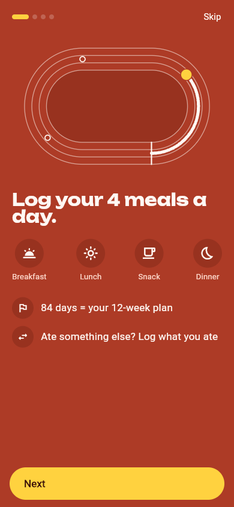<br><sub><b>The idea</b><br>4 meals a day, 84 days</sub></td>
<td align="center">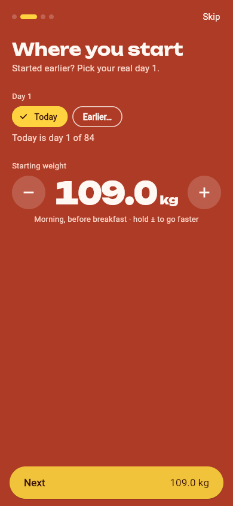<br><sub><b>Where you start</b><br>day 1 and starting weight</sub></td>
</tr>
<tr>
<td align="center">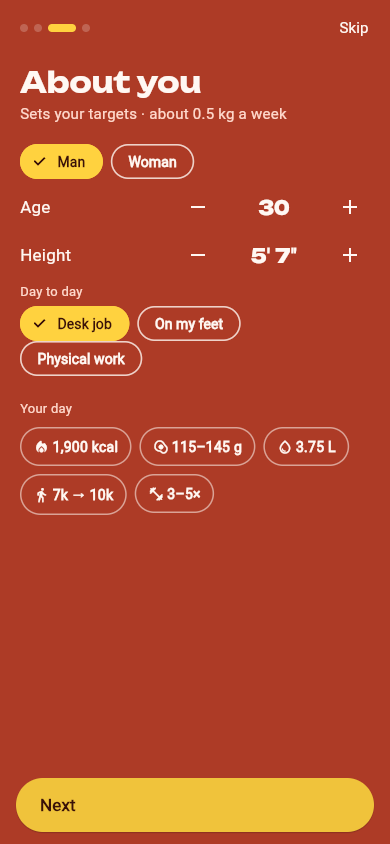<br><sub><b>About you</b><br>height in feet and inches, targets worked out live</sub></td>
<td align="center">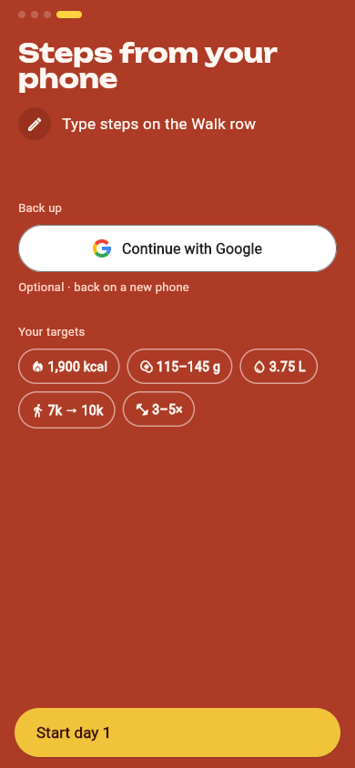<br><sub><b>Steps and backup</b><br>Health Connect / Apple Health, Google sign-in</sub></td>
<td></td>
</tr>
</table>

### Every day

<table>
<tr>
<td align="center">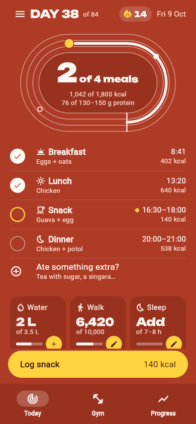<br><sub><b>Today</b><br>meals, the track, water · walk · sleep</sub></td>
<td align="center">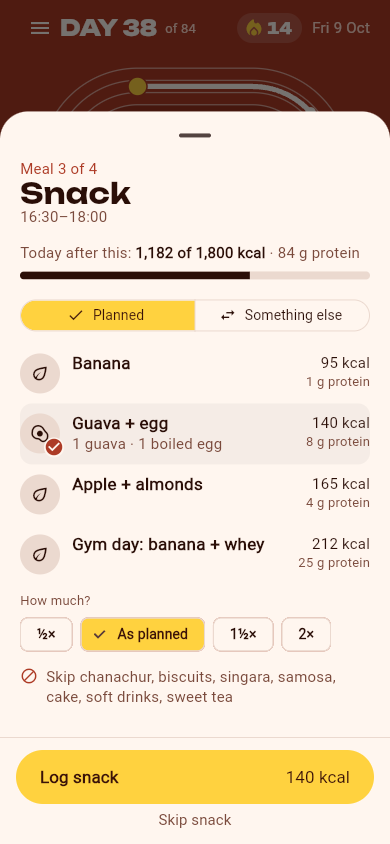<br><sub><b>Log a meal</b><br>planned option and portion</sub></td>
<td align="center"><br><sub><b>Something else</b><br>"vat" finds every bhaat plate</sub></td>
</tr>
<tr>
<td align="center"><br><sub><b>Gym</b><br>push / pull / legs, one tap per set</sub></td>
<td align="center"><br><sub><b>Progress</b><br>weight trend, pace, this week</sub></td>
<td align="center">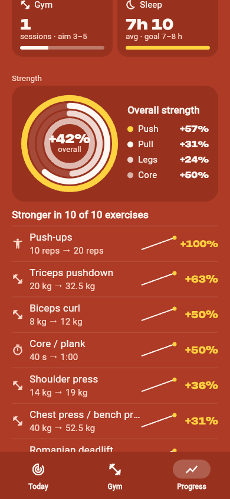<br><sub><b>Strength</b><br>rings per body area, every lift since day 1</sub></td>
</tr>
<tr>
<td align="center">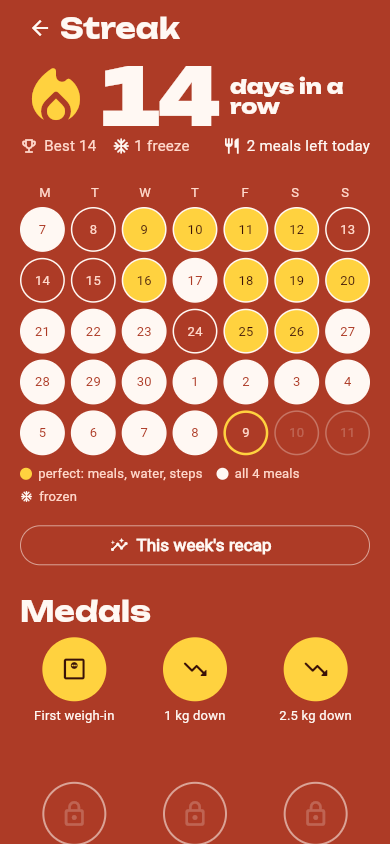<br><sub><b>Streak</b><br>calendar, freezes, medals</sub></td>
<td align="center">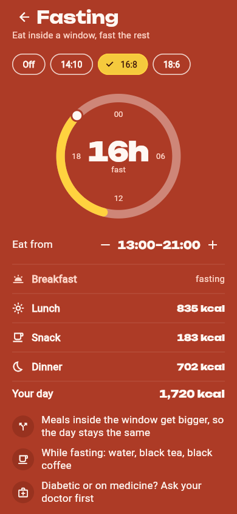<br><sub><b>Fasting</b><br>14:10 · 16:8 · 18:6, meals resized to fit</sub></td>
<td align="center">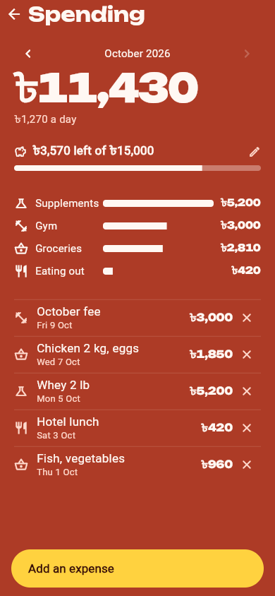<br><sub><b>Spending</b><br>what the diet and gym cost, in ৳</sub></td>
</tr>
</table>

<sub>Screenshots use sample data.</sub>

## Features

| Area | What you get |
|---|---|
| **Meals** | 4 meals with planned options sized to your calorie target · portions ½× to 2× · "something else" from a 201-food Dhaka list or your own foods · extras between meals · skip honestly · undo everything |
| **AI estimates** | Type *"2 parathas, dim bhaji and milk tea"* and get each item with kcal, protein and category, grounded in the Dhaka food list · saved estimates reused with no AI · free-tier counter shows uses left today |
| **Search** | English, every Banglish spelling and Bangla script (448 researched word groups) · typos forgiven · "fish" finds rui and ilish, but "rui" doesn't find ilish |
| **Gym** | Push / pull / legs rotation · tap a set circle to log it · rest timer on the lock screen · automatic step-ups when every rep is hit, a 10% deload after two short sessions · stop early when strength runs out |
| **Progress** | Weight chart with the 7-day average and month targets · pace gauge (0.6–0.9 kg a week) · stall detection · this week's calories, protein, gym, sleep · overall strength rings · every lift start → now |
| **Habits** | Streak with freezes · "streak ends at midnight" reminder · perfect days (meals + water + steps) · medals · Sunday recap · family board |
| **Body** | Personal targets from sex, age, height (feet and inches) and activity · water goal · steps 7k → 10k · sleep from Health Connect |
| **Fasting** | 14:10, 16:8, 18:6 with a movable window · meals outside it become "Fasting" and the rest grow so the day stays the same size |
| **Money** | Spending by category against a monthly budget |
| **Glanceable** | Four Android widgets and iOS widgets, a Live Activity for rest and treadmill, local reminders with Log / Skip / + Glass buttons |
| **Data** | Works offline · Google sign-in backs up to Firestore · export as JSON · delete cloud data and account · erase the phone |

## How a day works

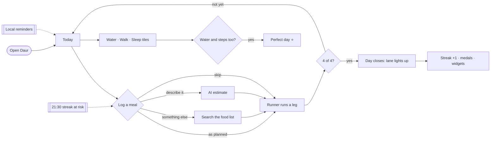

## Architecture

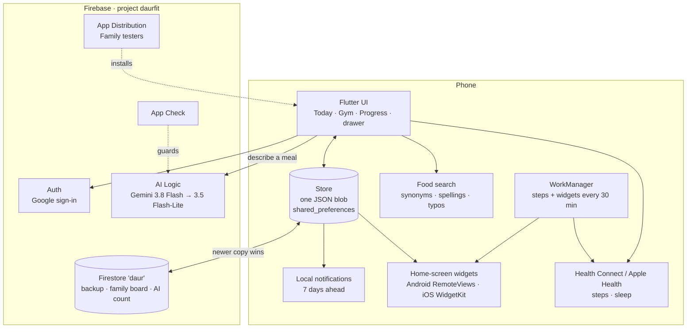

### An AI estimate, step by step

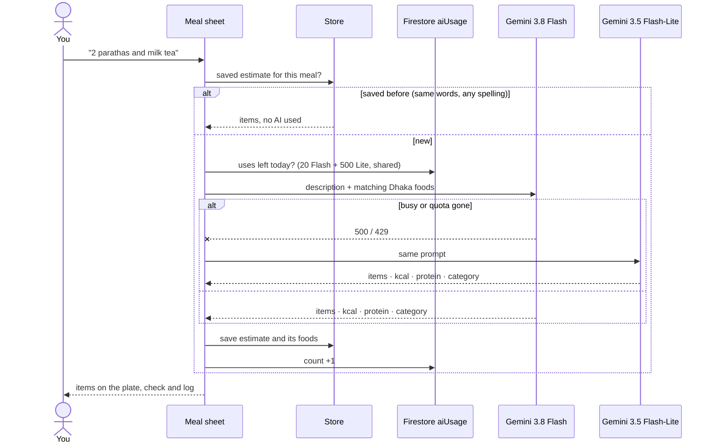

### Gym progression

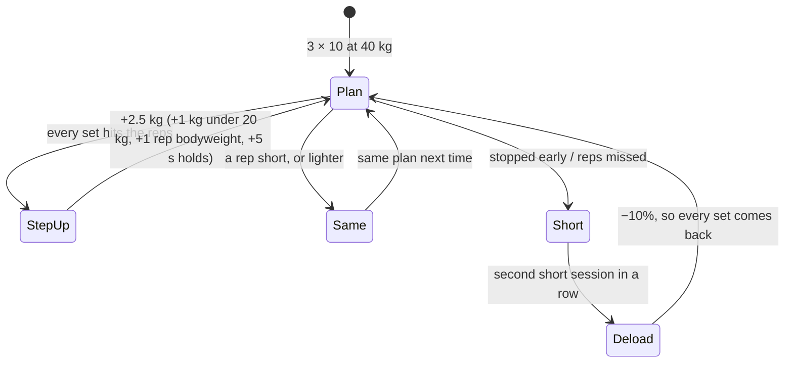

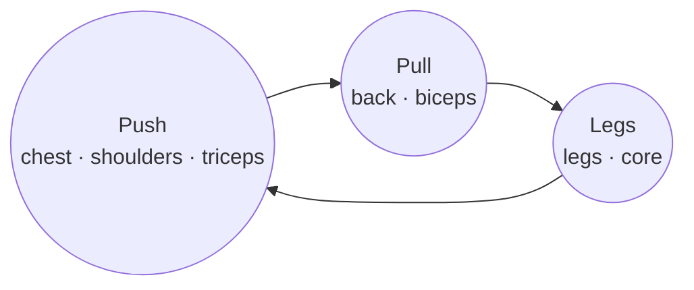

The next day is the one after the last day you actually trained, so a missed gym day never shifts the rotation.

### Cloud data

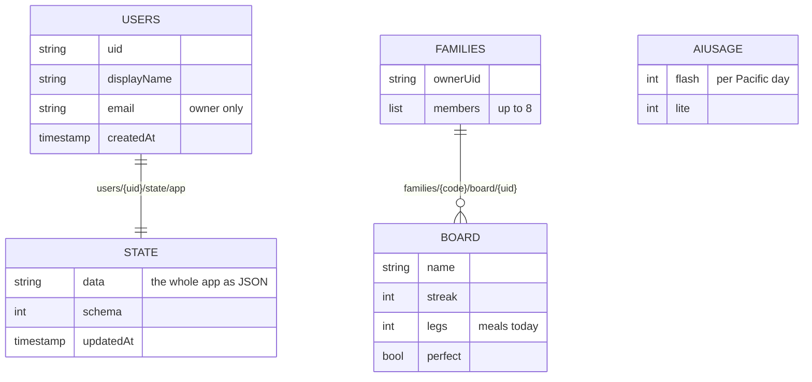

Security rules (`firestore.rules`) keep each person's data private to them, the family board visible only to its members, and every write validated field by field.

## Getting started

```bash
flutter pub get
flutter run -d <android-device>        # or: -d chrome, or an iPhone
flutter test                           # 35 tests: store, search, progression, reminders, quotas
```

The AI estimate needs an App Check token. Put it in `dart_defines.json` (git-ignored):

```json
{ "APPCHECK_DEBUG_TOKEN": "your-registered-debug-token" }
```

and build with `--dart-define-from-file=dart_defines.json`. Without it everything else still works.

**Health data:** Android reads steps and sleep through Health Connect (built into Android 14+). On iOS, add the HealthKit capability in Xcode. On the web, steps and sleep are typed in.

## Release to testers

```bash
./release.sh "What changed"
```

It bumps the build number, runs the tests, builds a release APK and sends it to the **Family** group through Firebase App Distribution. Testers install it with the Firebase App Tester app.

## Project map

| Path | What's there |
|---|---|
| `lib/main.dart` | App shell: bottom bar, drawer, routing, background refresh |
| `lib/store.dart` | All state and its rules: meals, streaks, freezes, targets, gym split and progression, strength, fasting, spending |
| `lib/plan.dart` | The plan: meals and options, gym defaults, personal targets (Mifflin–St Jeor) |
| `lib/today.dart` · `meal_sheet.dart` · `track.dart` | Today, the meal sheet, the animated track |
| `lib/gym.dart` · `workout.dart` | Push / pull / legs, set circles, rest bar, exercise and treadmill screens |
| `lib/progress.dart` · `streak.dart` | Weight chart, strength rings, recap, streak calendar, medals |
| `lib/food_search.dart` · `food_words.dart` · `foods.dart` | Matching, the researched vocabulary, the 201-food Dhaka list |
| `lib/meal_ai.dart` | AI estimates: grounding, model fallback, quota, saved estimates |
| `lib/cloud.dart` | Google sign-in, Firestore sync, family board, AI count, account deletion |
| `lib/fasting.dart` · `spending.dart` · `family.dart` · `targets.dart` · `your_data.dart` | Drawer screens |
| `lib/reminders.dart` · `widget_sync.dart` · `live.dart` | Notifications, widgets, Live Activities |
| `android/…/DaurWidgets.kt` · `ios/DaurWidget/` | Native widgets |
| `firestore.rules` · `firebase.json` | Security rules and Firebase config |
| `design/` | Design direction, research and these screenshots |

## Privacy

Everything lives on the phone first and works offline. Signing in backs it up to your own Firestore document, readable only by you. The AI sees only the food you type plus matching food-list entries. You can export all of it, delete the cloud copy and account, or erase the phone from **Menu → Your data**.
